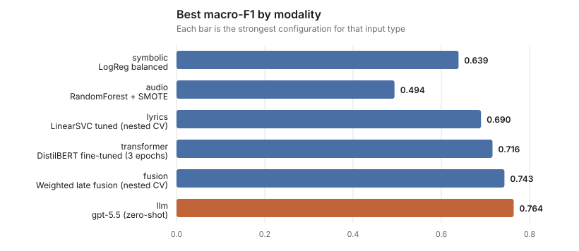

# Music Emotion Recognition

Predicting the emotional quadrant of a song from its notes, its recording, and its words — then
combining them.

Every model predicts one of four quadrants from the circumplex model of affect:

| Quadrant | Valence | Arousal | Feels like |
|---|---|---|---|
| Q1 | high | high | joyful, upbeat |
| Q2 | low | high | tense, angry |
| Q3 | low | low | gloomy, sad |
| Q4 | high | low | calm, tender |

## Results



| Modality | Best model | Macro-F1 |
|---|---|---|
| Symbolic (EMOPIA MIDI) | LogReg balanced | 0.639 |
| Audio (DEAM) | RandomForest + SMOTE | 0.494 |
| Lyrics (MERGE) | LinearSVC tuned | 0.690 |
| Transformer | DistilBERT fine-tuned | 0.716 |
| **Fusion (audio + lyrics)** | **Weighted late fusion** | **0.743** |
| LLM | gpt-5.5 zero-shot | 0.764 |

Full per-experiment numbers, including per-class F1 and configs, are in
[results/EXPERIMENTS.md](results/EXPERIMENTS.md) and
[results/results_detailed.csv](results/results_detailed.csv).

## Setup

```bash
pip install -e ".[dev]"
```

Optional extras: `.[transformer]` for the DistilBERT track, `.[llm]` for the GPT baselines.

Datasets are not redistributed here. Place them under `data/raw/` as `deam/`, `emopia/`, and
`merge/`, then build the processed tables:

```bash
python -m music_emotion.pipeline
```

## Scoring a song

Train the fusion model once, then point it at any track:

```bash
python -m music_emotion.predict train
```

`--audio-only` fits just the audio branch and skips reading the lyrics corpus entirely, which is
much faster and is what the timeline uses:

```bash
python -m music_emotion.predict train --audio-only --model models/audio.joblib
```

```bash
python -m music_emotion.predict song --audio track.mp3 --lyrics track.txt
```

The audio must be a decodable file (MP3, FLAC, WAV). DRM-protected downloads from streaming
services will not load.

## Desktop app

```bash
python -m music_emotion.app
```

A native Tk window: pick a song, optionally a lyrics file, and get the dominant quadrant, the
valence/arousal timeline, the trajectory plotted in circumplex space, a per-window table, and the
benchmark results. If no model exists yet it trains an audio-only one on first run.

Tkinter ships with most Python builds; on Homebrew Python install it with
`brew install python-tk@3.12`.

## Emotion over time

A single label flattens a song that changes. `timeline` slides the same 30-second window the model
was trained on across a whole track and charts the result:

```bash
python -m music_emotion.timeline --audio track.mp3 --lyrics track.txt
```

It writes a per-window CSV and an SVG showing valence and arousal over time, with a colour strip of
the winning quadrant per window. `--window` and `--hop` control the granularity; `--hop 15` with the
default 30s window gives overlapping, smoother curves.

Lyrics are not time-aligned, so when supplied they shift every window by the same amount — the
*shape* of the trajectory always comes from audio. Omit `--lyrics` to chart the audio branch alone.

## Reproducing the figures

```bash
python -m music_emotion.figures
```

Charts are generated from `results/results_summary.csv` with no plotting dependency. CI runs
`--check` so committed figures can't drift from the logged numbers.

## Layout

```
src/music_emotion/
  pipeline.py            build processed tables from raw datasets
  symbolic_baseline.py   EMOPIA MIDI features -> classifier
  lyrics_baseline.py     MERGE lyrics TF-IDF -> classifier
  audio_baseline.py      DEAM openSMILE features -> classifier
  fusion_baseline.py     early and weighted late fusion
  lyrics_transformer.py  DistilBERT fine-tune
  llm_baseline.py        zero-/few-shot GPT baselines
  predict.py             train once, score arbitrary songs
  timeline.py            windowed analysis + trajectory chart
  figures.py             blog charts from logged results
  evaluate.py            shared CV helpers
  tuning.py              nested CV searches
```

## Tests

```bash
pytest
```
