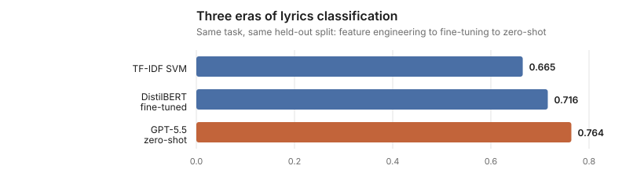

# Music Emotion Recognition

[](https://github.com/aaditg/MusicSentimentAnalysis/actions/workflows/ci.yml)

What emotion does a song express? This project answers that from three angles — the notes
(symbolic MIDI), the recording (audio), and the words (lyrics) — then fuses them, and benchmarks
the result against a fine-tuned transformer and zero-shot LLMs.

Beyond the research, it ships tools to score **any song you have on disk**: a one-shot classifier
with calibrated confidence, a windowed timeline that charts how a track's emotion moves from start
to finish, and a native desktop app that wraps both.

## The four quadrants

Every model predicts one of four quadrants of the circumplex model of affect — two axes, valence
(positive vs. negative) and arousal (energetic vs. subdued):

| Label | Valence | Arousal | Shown as |
|---|---|---|---|
| **Q1** | high | high | joyful |
| **Q2** | low | high | tense |
| **Q3** | low | low | gloomy |
| **Q4** | high | low | calm |

The `Q1`–`Q4` labels are what the datasets annotate and what the models emit. The adjectives are
display names chosen for readability in `timeline.py`; they are not in the training data.

## Results


| Modality | Dataset | Best model | Macro-F1 |
|---|---|---|---|
| Symbolic | EMOPIA (MIDI) | LogReg balanced | 0.639 |
| Audio | DEAM | RandomForest + SMOTE | 0.494 |
| Lyrics | MERGE | LinearSVC tuned | 0.690 |
| Transformer | MERGE | DistilBERT fine-tuned | 0.716 |
| **Fusion** | MERGE bimodal | **Weighted late fusion** | **0.743** |
| LLM | MERGE | gpt-5.5 zero-shot | 0.764 |

Audio alone is the weakest modality — it hears energy well but struggles with valence, collapsing
on the two quadrants where the axes disagree (Q2, Q4). Fusing audio with lyrics adds +0.06 over
the best single modality: the two are genuinely complementary.



Every experiment, with per-class F1 and exact configs, is logged in
[results/EXPERIMENTS.md](results/EXPERIMENTS.md), [results/results_detailed.csv](results/results_detailed.csv)
and the append-only [results/experiments.jsonl](results/experiments.jsonl). The narrative write-up
is [blog.md](blog.md).

## Setup

Python 3.10+ (developed on 3.12).

```bash
python3.12 -m venv .venv
.venv/bin/pip install -e ".[dev]"
```

Extras: `.[transformer]` adds torch/transformers for the DistilBERT track; `.[llm]` adds the
OpenAI client for the GPT baselines. Neither is needed for scoring songs.

**macOS note.** Homebrew's `python@3.12` 3.12.14 bottle ships a `pyexpat` linked against a system
`libexpat` that lacks a symbol it needs, which breaks pip and XML parsing. If `pip` fails inside the
venv with an `ensurepip` or `_XML_SetAllocTrackerActivationThreshold` error, build the venv from a
pyenv interpreter instead (`~/.pyenv/versions/3.12.x/bin/python -m venv .venv`) or compile Python
locally with `brew install --build-from-source python@3.12`. The desktop app additionally needs Tk,
which pyenv builds usually lack — see [Desktop app](#desktop-app).

### Data

Datasets are not redistributed. `acquire.py` downloads the public archives (URLs in `sources.py`)
into `data/raw/_archives/`; extract them so the raw tree looks like:

```
data/raw/
  deam/      MEMD_audio/, annotations/, features/ (openSMILE), metadata/
  emopia/    EMOPIA_2.2/ (MIDI + label CSVs)
  merge/     MERGE_Audio_Complete/, MERGE_Lyrics_Complete/, MERGE_Bimodal_Complete/
```

Then build the processed tables and run the three baseline trainers in one go:

```bash
python -m music_emotion.pipeline
```

That writes eight CSVs to `data/processed/` — harmonised labels plus aggregated MIDI, openSMILE
and librosa features. Only `data/processed/` is needed to train the inference models; the raw
lyrics corpus is read when fitting the lyrics branch.

`data/`, `models/` and `results/timelines/` are gitignored.

## Scoring a song

Train once. The default fits the full audio + lyrics fusion model:

```bash
python -m music_emotion.predict train
```

```bash
python -m music_emotion.predict train --audio-only --model models/audio.joblib
```

`--audio-only` fits just the audio branch from the processed CSV — it skips the lyrics corpus
entirely and trains in seconds. Both variants are **calibrated by default**: each branch's
LinearSVC is wrapped in `CalibratedClassifierCV` (Platt scaling, 5-fold), so outputs are
probabilities rather than raw margins. `--no-calibrate` keeps the old unbounded scores.

Then point it at a track and its lyrics as a plain `.txt`:

```bash
python -m music_emotion.predict song --audio track.mp3 --lyrics track.txt
```

```
Quadrant:  Q3  (valence low, arousal low)   confidence 69%

Probabilities:
  Q3   68.9%
  Q4   27.2%
  Q2    2.0%
  Q1    1.9%

Lyrics alone: Q3
Audio alone:  Q4
```

The per-modality lines are the useful part: when audio and lyrics disagree, you know how much to
trust the call. (Here lyrics were right, audio was wrong, and the weighted blend landed correctly.)

Audio must be a decodable file — MP3, FLAC, WAV, AIFF. DRM-protected downloads from streaming
services will not load. Only the first 30 seconds are used, matching the excerpt length the
datasets were annotated on; for anything longer or structurally varied, use the timeline.

## Emotion over time

A single label flattens a song that goes somewhere. `timeline` slides the same 30-second window
the model was trained on across the whole track — every prediction stays in-distribution — and
turns one label into a trajectory:

```bash
python -m music_emotion.timeline --audio track.mp3
```

```
time          quadrant          valence  arousal    conf
0:00-0:30     Q4 (calm)           -0.21    -0.37     37%
0:30-1:00     Q4 (calm)           +0.07    -0.89     52%
...
6:30-7:00     Q4 (calm)           +0.69    -0.97     83%
...
11:30-11:59   Q2 (tense)          -0.97    +0.36     68%

Windows: 24   Dominant: Q4 (calm), 19/24
```

It writes two files to `results/timelines/`:

- **`<track>.svg`** — valence and arousal as lines over time, with a colour strip of the winning
  quadrant per window.
- **`<track>.csv`** — one row per window: `start_s, end_s, quadrant, valence, arousal, Q1, Q2, Q3, Q4`.
  The last four columns are the full probability distribution, so you can see *how* a call was made.

Options:

| Flag | Default | Meaning |
|---|---|---|
| `--window` | 30 | window length in seconds |
| `--hop` | 30 | seconds between window starts; `--hop 15` overlaps windows for smoother curves |
| `--lyrics` | — | optional; see below |
| `--model` | `models/fusion.joblib` | use `models/audio.joblib` for audio-only |
| `--out-dir` | `results/timelines` | |
| `--title` | filename | chart title |

**Lyrics are not time-aligned.** If supplied, the lyrics branch sees the whole text for every window
and shifts each point by the same constant. The *shape* of the trajectory always comes from audio.
Omit `--lyrics` to chart the audio branch alone, which is the honest default for long-form tracks.

### Reading the numbers

- **Probabilities** (`Q1`–`Q4`) sum to 1. The quadrant is the argmax; **confidence** is its
  probability. Chance is 25%, so a window at 37% is close to a guess — the model is telling you it
  can't place it.
- **Valence and arousal** are the probabilities projected back onto the axes they came from:

      valence = (Q1 + Q4) − (Q2 + Q3)
      arousal = (Q1 + Q2) − (Q3 + Q4)

  Both are bounded to [−1, +1] and **comparable across songs**. Charts pin the axis at ±1 for that
  reason. (Uncalibrated models produce unbounded margins; those charts rescale per track and the
  numbers only mean something relative to the same song.)
- Arousal is the reliable axis. Valence from audio alone is the weak one — see the results table.

## Desktop app

```bash
python -m music_emotion.app
```

A native Tk window, no server. Pick a song and optionally a lyrics file; it uses the fusion model
when lyrics are given and the audio-only model otherwise, training the latter on first run if it
doesn't exist. Four tabs:

- **Timeline** — the valence/arousal chart with hover readout per window
- **Circumplex** — the same windows as a path through valence/arousal space
- **Windows** — the per-window table with confidence
- **Benchmarks** — `results_summary.csv`, best row highlighted

Analysis runs on a worker thread so the window stays responsive. Requires `tkinter`; on Homebrew
Python that's `brew install python-tk@3.12` (pyenv builds generally don't include it).

## Reproducing the experiments

These are the cross-validated runs behind the results table. Each prints fold metrics and appends
to `results/experiments.jsonl` and `results/EXPERIMENTS.md`.

```bash
python -m music_emotion.fusion_baseline
```

```bash
python -m music_emotion.tuning --modality all
```

```bash
python -m music_emotion.ablation
```

`tuning` accepts `--modality symbolic|lyrics|audio` and runs nested cross-validation searches.
`ablation` drops one modality at a time from the fused model.

The transformer track needs the `transformer` extra:

```bash
python -m music_emotion.lyrics_transformer --epochs 3 --batch-size 16
```

The LLM baselines need the `llm` extra and `OPENAI_API_KEY` in the environment:

```bash
python -m music_emotion.llm_baseline --models gpt-5.5 gpt-4.1-mini --shots zero few
```

Responses are cached in `results/_llm_cache/` so reruns don't re-spend API calls; `--limit N` caps
the test set for a cheap smoke run.

## Figures

```bash
python -m music_emotion.figures
```

The charts in `results/figures/` are rendered from `results/results_summary.csv` as plain SVG
with no plotting dependency. `--check` fails if the committed figures don't match the logged
numbers; CI runs it so the two can't drift.

## Tests and lint

```bash
pytest
```

```bash
ruff check src tests && ruff format --check src tests
```

CI (`.github/workflows/ci.yml`) runs lint, format check, the test suite on Python 3.10 and 3.12,
and the figure freshness check on every push and pull request.

## Layout

```
src/music_emotion/
  labels.py               quadrant definitions and valence/arousal -> quadrant mapping
  sources.py              dataset artifact URLs
  acquire.py              download dataset archives
  inventory.py            summarise what's in data/raw
  normalize.py            harmonise raw labels into processed tables
  audio_features.py       aggregate DEAM openSMILE frames
  midi_features.py        extract EMOPIA MIDI features
  merge_audio_features.py librosa features for MERGE clips (shared by timeline)
  report.py               describe processed tables
  pipeline.py             normalize + features + baselines, end to end

  symbolic_baseline.py    EMOPIA MIDI features -> classifier
  lyrics_baseline.py      MERGE lyrics TF-IDF -> classifier
  audio_baseline.py       DEAM openSMILE features -> classifier
  fusion_baseline.py      early fusion, weighted late fusion, AudioOnly; calibration lives here
  tuning.py               nested CV searches per modality
  ablation.py             drop-one-modality ablation
  lyrics_transformer.py   DistilBERT fine-tune
  llm_baseline.py         zero-/few-shot GPT baselines with response cache
  evaluate.py             shared cross-validation helpers
  results_log.py          experiments.jsonl + EXPERIMENTS.md writer

  predict.py              train once, score one song
  timeline.py             windowed analysis, trajectory CSV + SVG
  app.py                  Tk desktop app
  figures.py              results charts as dependency-free SVG
  datasets.py, roadmap.py, main.py   project overview (`python -m music_emotion.main`)

tests/                    label mapping, figure rendering, timeline/circumplex maths
results/                  logged experiments, figures, timelines, LLM cache
```
